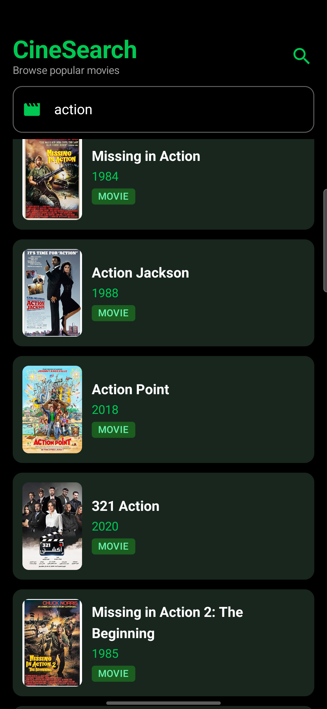
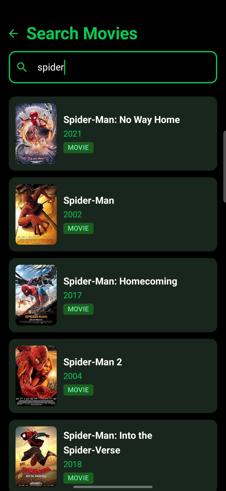
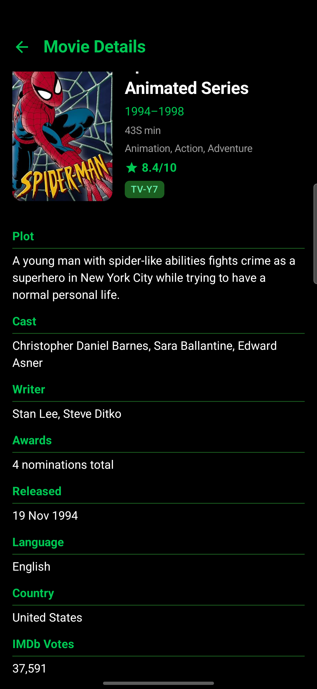

# 🎬 CineSearch-Android

🚀 Production-ready Android movie browsing app demonstrating **Jetpack Compose, Clean Architecture, Paging 3, Coroutines & Flow**

A modern Android application to browse, search, and explore movies using the [OMDb API](http://www.omdbapi.com/). Built with scalable architecture and real-world patterns.

---

## 📱 Screenshots

### 🏠 Home Screen



### 🔍 Search Screen



### 📄 Detail Screen



---

## ✨ Features

* 🎬 Browse movies with **infinite scrolling (Paging 3)**
* 🔍 **Debounced live search** with real-time results
* 📄 Detailed movie info (plot, cast, IMDb rating, runtime, awards)
* 🌙 Custom **Material 3 dark theme**
* ⚠️ Graceful handling of **loading & error states**

---

## 🧠 Key Engineering Decisions

* Used **Paging 3** for scalable pagination instead of manual scroll handling
* Implemented **debounce + flatMapLatest** to prevent stale search results
* Centralized API key using **OkHttp Interceptor**
* Used **StateFlow** for predictable UI state management
* Followed **MVVM + Clean Architecture** for maintainability

---

## 🏗️ Architecture

This project follows **MVVM + Clean Architecture**

```
UI → ViewModel → Domain → Data
```

* Repository acts as **single source of truth**
* Lifecycle-aware & fully testable
* Clear separation of concerns

---

## 🗂️ Project Structure

```
data/
domain/
ui/
di/
```

---

## 🛠️ Tech Stack

**Core:** Kotlin • Jetpack Compose • MVVM
**Concurrency:** Coroutines • Flow • StateFlow
**Networking:** Retrofit • OkHttp
**Pagination:** Paging 3
**DI:** Hilt
**Images:** Coil

---

## 🧪 Testing

* Unit tests for ViewModel, Repository & PagingSource
* MockK + Coroutines Test + Turbine

---

## 🚀 Future Improvements

* 🎥 Video streaming with ExoPlayer
* 💾 Offline caching using Room
* 📥 Download & watch later

---

## 🌐 API

* OMDb API

---

## 🚀 Getting Started

```bash
git clone <your-repo-url>
```

* Open in Android Studio
* Sync Gradle
* Run app

---

## 📌 Why This Project Matters

This project demonstrates:

* ✅ Production-ready Android architecture
* ✅ Scalable pagination & state management
* ✅ Clean, maintainable, testable code
* ✅ Real-world app design patterns

---

⭐ If you found this useful, give it a star!
